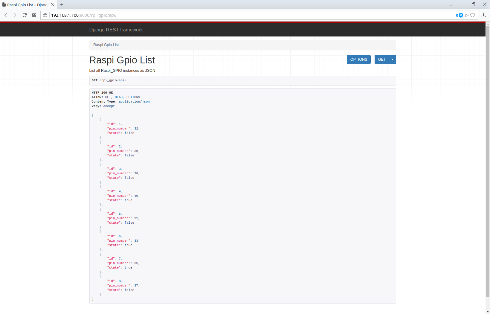
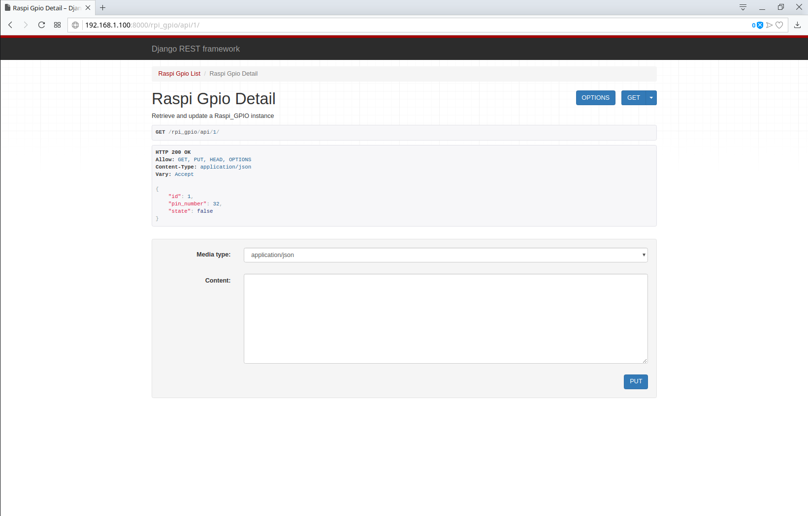

# Raspberry Pi Django Project

## Web Interface


## Web API Interface
The Django REST framework makes it easy list of all of the objects in the database using a web browser:


Or viewing the details of a single instance:


## Interfacing with the API using python requests module
Get a list of all objects:
```
>>> import requests
>>> 
>>> url = 'http://192.168.1.100:8000/rpi_gpio/api/'
>>> r = requests.get(url)
>>> r.text
'[{"id":1,"pin_number":32,"state":true},{"id":2,"pin_number":36,"state":false},{"id":3,"pin_number":38,"state":false},{"id":4,"pin_number":40,"state":true},{"id":5,"pin_number":31,"state":false},{"id":6,"pin_number":33,"state":true},{"id":7,"pin_number":35,"state":true},{"id":8,"pin_number":37,"state":false}]'
>>>
```

You can also get the details of a single instance or update the state of it:
```
>>> url = 'http://192.168.1.100:8000/rpi_gpio/api/1/'
>>> data = {'state': False}
>>> 
>>> r = requests.get(url)
>>> r.text
'{"id":1,"pin_number":32,"state":true}'
>>> 
>>> r = requests.put(url, json=data)
>>> r.text
'{"id":1,"pin_number":32,"state":false}'
>>> 
```

## Limitations
This web app relies on the primary key Django gives to each object up creation of it when saving it to the database. Particularly keys 1-8 for the web interface.

## Inspiration
This web app was inspired by a project posted on Instructables [Simple and Intuitive Web Interface for Your Raspberry Pi](https://www.instructables.com/id/Simple-and-intuitive-web-interface-for-your-Raspbe/). I wanted to replicate the project using Django which also required learning a little bit of AJAX, jQuery, and the Django REST framework to put it all together.
